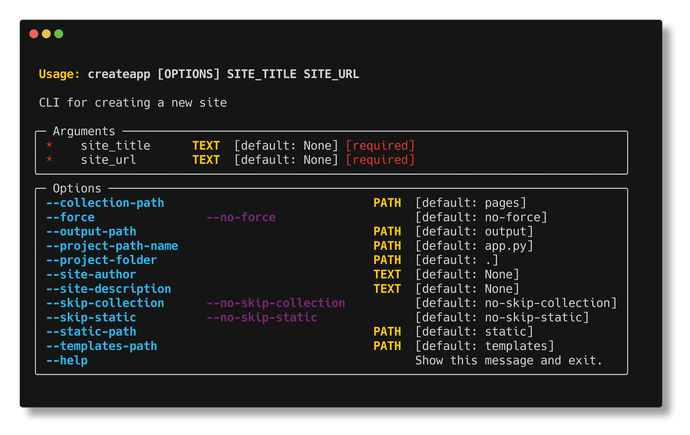

## Build your site with `create-app`

You can get started quickly using the `create_app` command.

```bash
$ create-app
```

or

```bash
$ python -m render_engine.create_app
```

!!! Warning
    This is a work in progress. It is not ready for production. The callable `create_app` may be changed to a different name.

### Available Options

`create-app` has a few options that you can use to customize your site. While you must provide a `site_title` and `site_url`, other values are optional.

You can view the options using the `--help` flag.



#### `collection-path` (`Path`: default=`"pages"`)

The path to the folder that will contain your [collections](../collection). This is where you will put your data files to be processed.

#### `force` (`bool`: default=`False` as `no-force`)

Overwrite existing files and folders. If `no-force`, an error will be raised if **ANY** of the files already exist.

#### `output-path` (`Path`: default=`"output"`)

The path to the [`output`](../../site#output_path) directory. This is where your rendered site will be served.

#### `project-path-name` (`Path`: default=`"app.py"`)

The name of the python file that will contain the Render Engine setup. This is where you will define your [site](../../site), [pages](../../page) and [collections](../../collection).

#### `project-folder` (`Path`: default=`"."`)

The name of the folder that will contain your project. This is where your [`project-path-name`](#project-path-name-path-defaultapppy), [`output-path`](#output-path-path-defaultoutput), [`templates-path`](#templates-path-path-defaulttemplates), and [`collection-path`](#collection-path-path-defaultpages) will be created.

#### `site-description` (`str|None`: default=`None`)

A short description of your site.  This will be passed into the [`Site`](../site.md) object and available in [`site_vars`](../site.md#site_vars).

#### `site-author` - (`str|None` default: `None`)

The author of the site.  This will be passed into the [`Site`](../site.md) object and available in [`site_vars`](../site.md#site_vars).

#### `skip-collection` (`bool`: default=`False` as `no-skip-collection`)

If `True`, a [`collection-path`](../collection#content_path) folder will not be created.

#### `skip-static` - (`bool`: default: `False` as `no-skip-static`)

If `True`, will not create the [`static`](../../site#static_path) folder. This is where you will put your static files (images, css, js, etc).

#### `templates-path` (`Path`: default=`"templates"`)

The path to the folder that will contain your [`templates`](../templates). This is where you will put your Jinja2 templates.
