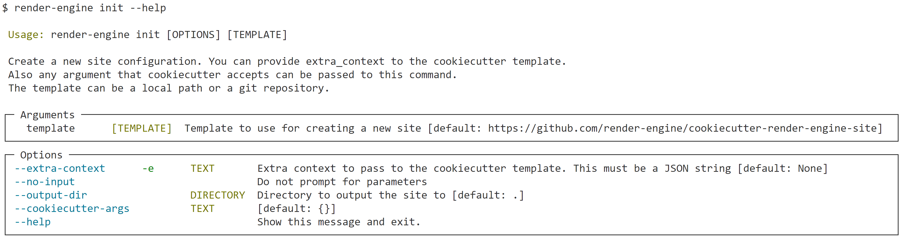

## Create your site file

You can get started quickly using the `render-engine init` cli command.

```bash
render-engine init
```

or

```bash
python -m render_engine init
```

## Available Options

`init` has a few options that you can use to customize your site

You can view the options using the `--help` flag.


Visit the [CLI - init](../cli.md) page for more information.

### Continue to [Simple Site Layout](../layout/)
